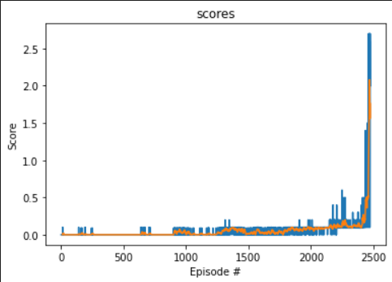

#### Udacity Deep Reinforcement Learning Nanodegree
### Project 3: Multi-Agent Collaboration & Competition
# Train Two RL Agents to Play Tennis
##### &nbsp;

## Goal
The goal of this project is to train two RL agents to play tennis. As in real tennis, the goal of each player is to keep the ball in play. And, when you have two equally matched opponents, you tend to see fairly long exchanges where the players hit the ball back and forth over the net.

##### &nbsp;

## The Environment
We'll work with an environment that is similar, but not identical to the [Tennis](https://github.com/Unity-Technologies/ml-agents/blob/master/docs/Learning-Environment-Examples.md#tennis) environment on the Unity ML-Agents GitHub page.

In this environment, two agents control rackets to bounce a ball over a net. If an agent hits the ball over the net, it receives a reward of +0.1.  If an agent lets a ball hit the ground or hits the ball out of bounds, it receives a reward of -0.01.  Thus, the goal of each agent is to keep the ball in play.

The observation space consists of 8 variables corresponding to the position and velocity of the ball and racket. Each agent receives its own, local observation.  Two continuous actions are available, corresponding to moves toward (or away from) the net, and jumping.

The task is episodic, and in order to solve the environment, your agents must get an average score of +0.5 (over 100 consecutive episodes, after taking the maximum over both agents). Specifically,

- After each episode, we add up the rewards that each agent received (without discounting), to get a score for each agent. This yields 2 (potentially different) scores. We then take the maximum of these 2 scores.
- This yields a single **score** for each episode.

The environment is considered solved when the average (over 100 episodes) of those **scores** is at least +0.5.


##### &nbsp;

## Approach
Here are the high-level steps taken in building an agent that solves this environment.

1. Establish performance baseline using a random action policy.
1. Select an appropriate algorithm and begin implementing it.
1. Run experiments, make revisions, and retrain the agent until the performance threshold is reached.

WARNING: I ultimately reached a good solution; however, the results were not consistent. My "best" results were only reproducible if I reran the model numerous times (>10). If you just run the model once (or even 3-5 times), it might not converge. And, during the initial implementation, I ran the model at least 30 times while searching for a reliable set of hyperparameters. If you want to experiment with different approaches, I strongly recommend implementing a more systematic approach such as grid search (which I did not do, but wish I had).

##### &nbsp;

### 1. Establish Baseline
Before building agents that learn, I started by testing ones that select actions (uniformly) at random at each time step.

Running the random agents a few times resulted in scores from 0 to 0.02. Obviously, if these agents need to achieve an average score of 0.5 over 100 consecutive episodes, then choosing actions at random won't work. However, when you watch the agents acting randomly, it becomes clear that these types of sporadic actions can be useful early in the training process. That is, they can help the agents explore the action space to find some signal of good vs. bad actions. This insight will come into play later when we implement the Ornstein-Uhlenbeck process and epsilon noise decay.

##### &nbsp;

### 2. Implement Learning Algorithm
To get started, there are a few high-level architecture decisions we need to make. First, we need to determine which types of algorithms are most suitable for the Tennis environment.

#### Policy-based vs Value-based Methods
There are two key differences in the Tennis environment compared to the 'Navigation' environment from two projects ago:
1. **Multiple agents** &mdash; The Tennis environment has 2 different agents, whereas the Navigation project had only a single agent.
2. **Continuous action space** &mdash; The action space is now _continuous_, which allows each agent to execute more complex and precise movements. Even though each tennis agent can only move forward, backward, or jump, there's an unlimited range of possible action values that control these movements. Whereas, the agent in the Navigation project was limited to four _discrete_ actions: left, right, forward, backward.

Given the additional complexity of this environment, the **value-based method** we used for the Navigation project is not suitable &mdash; i.e., the Deep Q-Network (DQN) algorithm. Most importantly, we need an algorithm that allows the tennis agent to utilize its full range and power of movement. For this, we'll need to explore a different class of algorithms called **policy-based methods**.

Here are some advantages of policy-based methods:
- **Continuous action spaces** &mdash; Policy-based methods are well-suited for continuous action spaces.
- **Stochastic policies** &mdash; Both value-based and policy-based methods can learn deterministic policies. However, policy-based methods can also learn true stochastic policies.
- **Simplicity** &mdash; Policy-based methods directly learn the optimal policy, without having to maintain a separate value function estimate. With value-based methods, the agent uses its experience with the environment to maintain an estimate of the optimal action-value function, from which an optimal policy is derived. This intermediate step requires the storage of lots of additional data since you need to account for all possible action values. Even if you discretize the action space, the number of possible actions can get quite large. And, using DQN to determine the action that maximizes the action-value function within a continuous or high-dimensional space requires a complex optimization process at every timestep.

##### &nbsp;

#### Multi-Agent Deep Deterministic Policy Gradient (MADDPG)
The original DDPG algorithm from which I extended to create the MADDPG version, is outlined in [this paper](https://arxiv.org/pdf/1509.02971.pdf), _Continuous Control with Deep Reinforcement Learning_, by researchers at Google Deepmind. In this paper, the authors present "a model-free, off-policy actor-critic algorithm using deep function approximators that can learn policies in high-dimensional, continuous action spaces." They highlight that DDPG can be viewed as an extension of Deep Q-learning to continuous tasks.

For the DDPG foundation, I used [this vanilla, single-agent DDPG](https://github.com/udacity/deep-reinforcement-learning/tree/master/ddpg-pendulum) as a template. Then, to make this algorithm suitable for the multiple competitive agents in the Tennis environment, I implemented components discussed in [this paper](https://papers.nips.cc/paper/7217-multi-agent-actor-critic-for-mixed-cooperative-competitive-environments.pdf), _Multi-Agent Actor-Critic for Mixed Cooperative-Competitive Environments_, by Lowe and Wu, along with other researchers from OpenAI, UC Berkeley, and McGill University. Most notable, I implemented their variation of the actor-critic method (see Figure 1), which I discuss in the following section.

Lastly, I further experimented with components of the DDPG algorithm based on other concepts covered in Udacity's classroom and lessons. My implementation of this algorithm (including various customizations) are discussed below.


##### &nbsp;

#### Actor-Critic Method
Actor-critic methods leverage the strengths of both policy-based and value-based methods.

Using a policy-based approach, the agent (actor) learns how to act by directly estimating the optimal policy and maximizing reward through gradient ascent. Meanwhile, employing a value-based approach, the agent (critic) learns how to estimate the value (i.e., the future cumulative reward) of different state-action pairs. Actor-critic methods combine these two approaches in order to accelerate the learning process. Actor-critic agents are also more stable than value-based agents, while requiring fewer training samples than policy-based agents.

What makes this implementation unique is the **decentralized actor with centralized critic** approach from [the paper by Lowe and Wu](https://papers.nips.cc/paper/7217-multi-agent-actor-critic-for-mixed-cooperative-competitive-environments.pdf). Whereas traditional actor-critic methods have a separate critic for each agent, this approach utilizes a single critic that receives as input the actions and state observations from all agents. This extra information makes training easier and allows for centralized training with decentralized execution. Each agent still takes actions based on its own unique observations of the environment.

You can find the actor-critic logic implemented as part of the `Agent()` class in `python/ddpg_agent.py` of the source code. The actor-critic models can be found via their respective `Actor()` and `Critic()` classes in `python/model.py`.

Note: As we did with Double Q-Learning in the last project, we're again leveraging local and target networks to improve stability. This is where one set of parameters `w` is used to select the best action, and another set of parameters `w'` is used to evaluate that action. In this project, local and target networks are implemented separately for both the actor and the critic.

```python
# Actor Network (w/ Target Network)
self.actor_local = Actor(state_size, action_size, random_seed).to(device)
self.actor_target = Actor(state_size, action_size, random_seed).to(device)
self.actor_optimizer = optim.Adam(self.actor_local.parameters(), lr=LR_ACTOR)

# Critic Network (w/ Target Network)
self.critic_local = Critic(state_size, action_size, random_seed).to(device)
self.critic_target = Critic(state_size, action_size, random_seed).to(device)
self.critic_optimizer = optim.Adam(self.critic_local.parameters(), lr=LR_CRITIC, weight_decay=WEIGHT_DECAY)
```


##### &nbsp;

#### Learning Interval
In the first few versions of my implementation, the agent only performed a single learning iteration per episode. Although the best model had this setting, this seemed to be a stroke of luck. In general, I found that performing multiple learning passes per episode yielded faster convergence and higher scores. This did make training slower, but it was a worthwhile trade-off. In the end, I implemented an interval in which the learning step is performed every episode. As part of each learning step, the algorithm then samples experiences from the buffer and runs the `Agent.learn()` method 10 times.

```python
UPDATE_EVERY = 2         # learning interval (no. of episodes)
NB_LEARN = 3           # number of passes per learning step
```

You can find the learning interval implemented in the `Agent.step()` method in `python/ddpg_ma.py` of the source code.

##### &nbsp;

#### Experience Replay
Experience replay allows the RL agent to learn from past experience.

As with the previous project, the algorithm employs a replay buffer to gather experiences. Experiences are stored in a single replay buffer as each agent interacts with the environment. These experiences are then utilized by the central critic, therefore allowing the agents to learn from each others' experiences.

The replay buffer contains a collection of experience tuples with the state, action, reward, and next state `(s, a, r, s')`. The critic samples from this buffer as part of the learning step. Experiences are sampled randomly, so that the data is uncorrelated. This prevents action values from oscillating or diverging catastrophically, since a naive algorithm could otherwise become biased by correlations between sequential experience tuples.

Also, experience replay improves learning through repetition. By doing multiple passes over the data, our agents have multiple opportunities to learn from a single experience tuple. This is particularly useful for state-action pairs that occur infrequently within the environment.

The implementation of the replay buffer can be found in the `python/ddpg_agent.py` file of the source code.

##### &nbsp;

## Results
Once all of the above components were in place, the agents were able to solve the Tennis environment. Again, the performance goal is an average reward of at least +0.5 over 100 episodes, taking the best score from either agent for a given episode.

The graph below shows the final training results. The best-performing agents were able to solve the environment in 607 episodes, with a top score of 5.2 and a top moving average of 0.927. The complete set of results and steps can be found in [this notebook](python/Tennis.ipynb).




##### &nbsp;

## Future Improvements
- **Address stability issues to produce more consistent results** &mdash; My "best" results are only reproducible if you run the model numerous times. If you just run it once (or even 3-5 times) the model might not converge. I ran the model at least 30 while searching for a good set of hyperparameters, so perhaps implementing a more systemic approach such as grid search would help. Otherwise, more research is needed to find a more stable algorithm, or to make changes to the current DDPG algorithm.
- **Add *prioritized* experience replay** &mdash; Rather than selecting experience tuples randomly, prioritized replay selects experiences based on a priority value that is correlated with the magnitude of error. This can improve learning by increasing the probability that rare or important experience vectors are sampled.
- **Batch Normalization** &mdash; I did not use batch normalization on this project, but I probably should have. I've used batch normalization many times in the past when building convolutional neural networks (CNN), in order to squash pixel values. But, it didn't occur to me that it would be to this project. This is an aspect of this [Google DeepMind paper](https://arxiv.org/pdf/1509.02971.pdf) that has proved tremendously useful in my implementation of other projects.
  - Similar to the exploding gradient issue mentioned above, running computations on large input values and model parameters can inhibit learning. Batch normalization addresses this problem by scaling the features to be within the same range throughout the model and across different environments and units. In additional to normalizing each dimension to have unit mean and variance, the range of values is often much smaller, typically between 0 and 1.
  - You can find batch normalization implemented for the actor, and for the critic, within `python/model.py` of the source code of my previous project. These greatly improved model performance.
